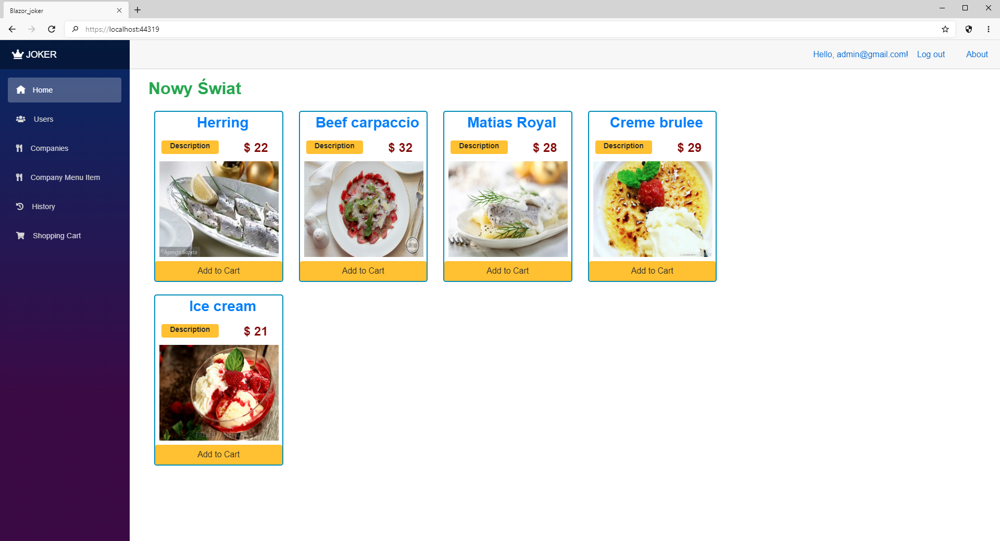
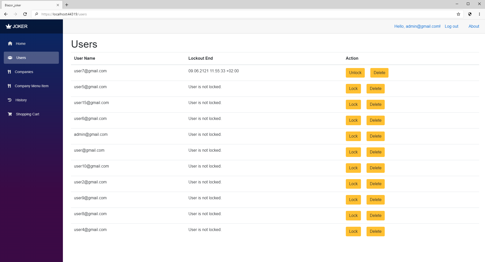
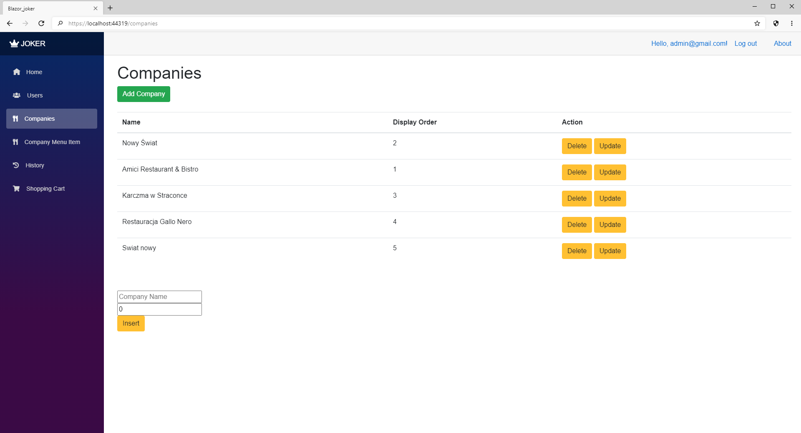
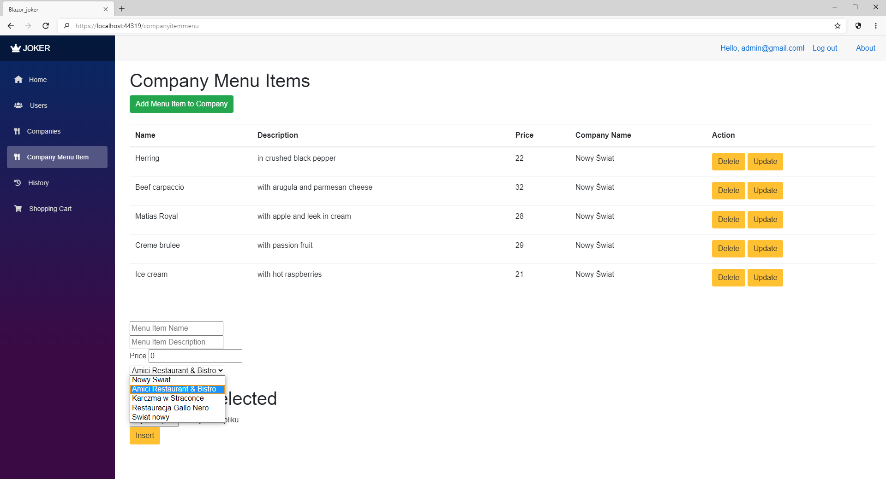
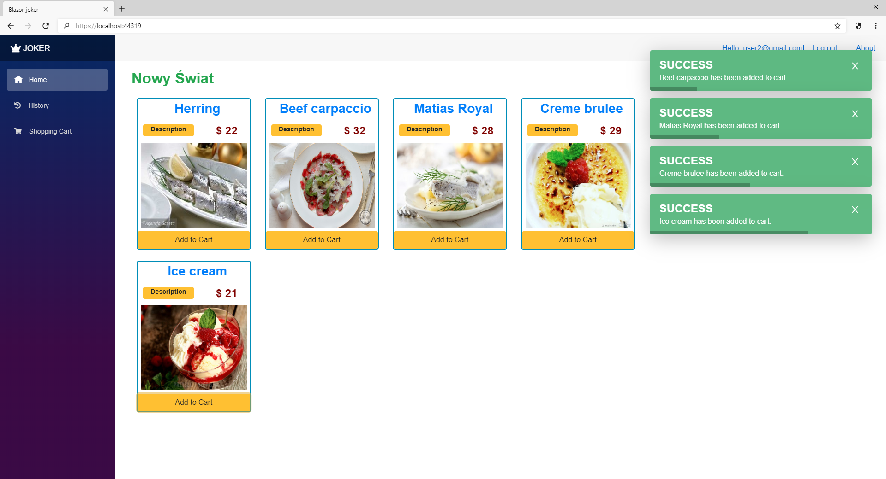
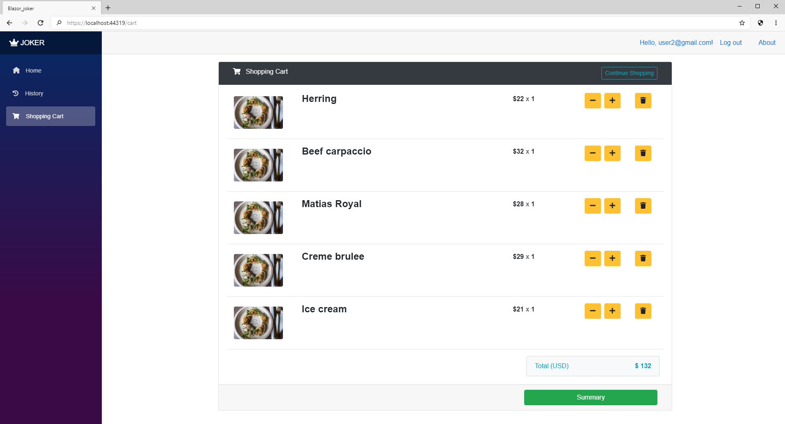
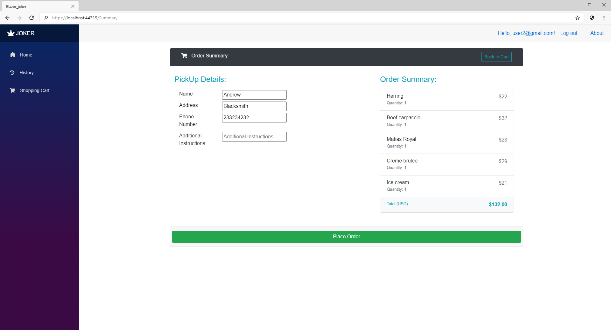
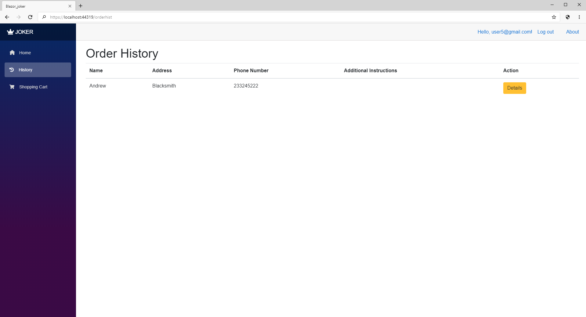

# Restaurant_Joker
A Web Application management for restaurants.
## Table of Contents
* [General Info](#general-informations)
* [Features](#features)
* [Screenshots](#screenshots)
* [Project Status](#project-status)
* [Contact](#contact)
## General Informations
Application prompts user for login and password. After logging in we can add items into our order to the cart and from cart send it to performance. The application has an administrator panel where we can manage users and check history of orders, but also we can add new companies and menu items. Application reacts to user actions notifying
them with alerts.
## Technologies Used
- Entity Framework
- Bootstrap
- BlazorPro.Spinkit 1.2.0
- Blazored.Toast 3.1.2
- Identity
## Features
- Add items to cart
- Manage order from the cart
- Order summary
- Order history
- Notifying alerts
- Administrator panel
  - Manage users
  - Manage companies
  - Manage companies' items
## Screenshots

## Project status
Project is: complete.
## Contact
Created by @szy.szymalski@gmail.com - feel free to contact me!
